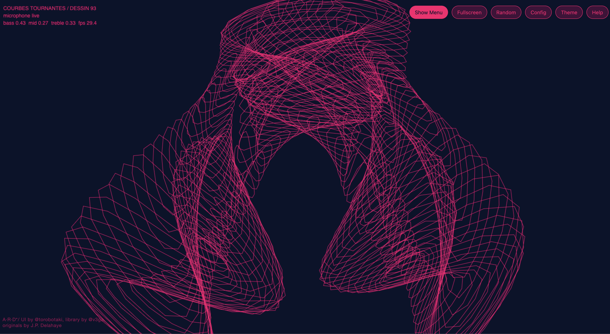

# A·R·D* / Audio-Reactive Dessins Geometriques et Artistiques

`A·R·D*` is an audio-reactive adaptation of [@v3ga](https://github.com/v3ga)'s recoding in p5.js recoding based on Jean-Paul Delahaye's *Dessins géométriques et artistiques avec votre micro-ordinateur*.

My intent is to provide an open-source and free audio-reactive visualisation tool that anyone can use and adapt. Don't hesitate to use and improve this <3 




## Quick start

### On Github Pages

Try it or use it here:

- https://dvalsamou.me/ard/


### Run it locally

- Download it, unzip it if necessary, and
- Serve the repository locally from the repository directory:

```bash
python3 -m http.server 8000
```

- Then open:

 `http://localhost:8000/`

The root page forwards directly to the audio-reactive master sketch.

#### Audio input note

- `A·R·D*` listens to whatever input device your browser exposes under microphone inputs.
- If you want to react to computer audio instead of a physical microphone, route system audio into a browser-visible input device first.
- On macOS, a common option is [BlackHole](https://existential.audio/blackhole/). On other systems, use the equivalent virtual audio device or loopback tool for that platform.

#### Performance 
**Kindly note**, if your **fps** drops under 10, the visuals are way to heavy for your browser, try something simpler. 


## What A·R·D* adds

- a single audio-reactive master sketch for live use
- multi-drawing composition on one canvas
- microphone-driven routing and per-parameter modulation
- import/export of full compositions
- theme system, favorites, HUD, and control UI
- family-level calibration so supported Delahaye families behave more consistently as live visuals

Coverage and tuning notes live in [AUDIO_REACTIVE_COVERAGE.md](AUDIO_REACTIVE_COVERAGE.md).

Credits and redistribution notes live in [CREDITS.md](CREDITS.md).

## Entry points

- Root entry point: [index.html](index.html)
- App entry point: `ard/index.html`
- Minimal starter: `sketches/p5js/sketches/11 - AUDIO REACTIVE - ORBITAL LINES/index.html`

## Upstream archive

The original `sketches/p5js/sketches/*` tree is intentionally kept in this repository as:

- the upstream p5.js archive
- a reference library for the source drawings
- a source base for the audio-reactive reinterpretation

If you want the original project, original gallery, original sketch-by-sketch documentation, or the original library details, use the upstream repo:

- [github.com/v3ga/dessins_geometriques_et_artistiques](https://github.com/v3ga/dessins_geometriques_et_artistiques)

This repo is intentionally focused on `A·R·D*` as the primary experience rather than duplicating the full upstream README.


Links:

- Website: [dvalsamou.me](https://dvalsamou.me)
- Original upstream repo: [v3ga/dessins_geometriques_et_artistiques](https://github.com/v3ga/dessins_geometriques_et_artistiques)
- Upstream p5.js collection: https://editor.p5js.org/v3ga/collections/ALPCSgG3E


Credits:

- Originals: [Jean-Paul Delahaye](https://fr.wikipedia.org/wiki/Jean-Paul_Delahaye)
- Library / p5.js recoding foundation: [@v3ga](https://github.com/v3ga)
- Audio-reactive adaptation, UI, composition system, calibration, and packaging: [@torobotaki](https://dvalsamou.me)

License:

- This repository remains distributed under the existing [GPL-2.0 license](LICENSE).
- `A·R·D*` is a derivative/adaptation built on top of the upstream codebase, not a clean-room rewrite.

## Development note

Parts of the audio-reactive adaptation, UI, and documentation were developed with the assistance of AI tools.
